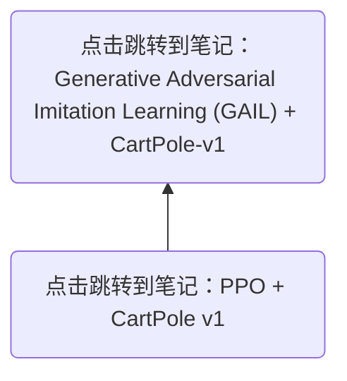

```mermaid
graph BT
    P1("点击跳转到笔记：PPO + CartPole v1") --> P2("点击跳转到笔记：Generative Adversarial Imitation Learning (GAIL) + CartPole-v1")
    click P1 "https://github.com/Gaoshu-root/Code-related-courses/blob/main/RL2024/PPO_%2B_CartPole_v1_.ipynb"
    click P2 "https://github.com/Gaoshu-root/Code-related-courses/blob/main/RL2024/Generative%20Adversarial%20Imitation%20Learning(GAIL)/Generative%20Adversarial%20Imitation%20Learning%20(GAIL)%20%2B%20CartPole-v1%20.ipynb"

```
