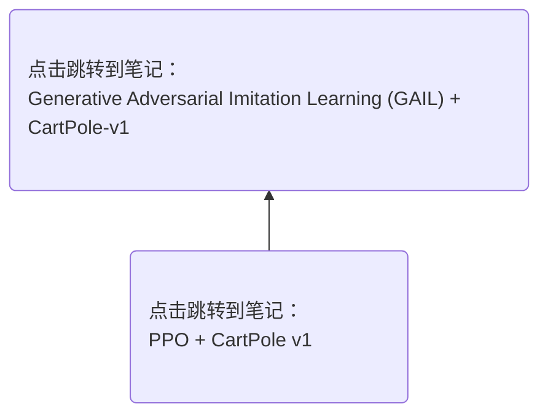

```mermaid
graph BT
    classDef wide2 padding:400px;
    classDef wide1 padding:200px;
    P1("<div style='text-align:left'>点击跳转到笔记：<br>PPO + CartPole v1</div>") --> P2("<div style='text-align:left'>点击跳转到笔记：<br>Generative Adversarial Imitation Learning (GAIL) + CartPole-v1</div>")
    class P1 wide1
    class P2 wide2
    click P1 "https://github.com/Gaoshu-root/Code-related-courses/blob/main/RL2024/PPO_%2B_CartPole_v1_.ipynb" _blank
    click P2 "https://github.com/Gaoshu-root/Code-related-courses/blob/main/RL2024/Generative%20Adversarial%20Imitation%20Learning(GAIL)/Generative%20Adversarial%20Imitation%20Learning%20(GAIL)%20%2B%20CartPole-v1%20.ipynb" _blank

```
